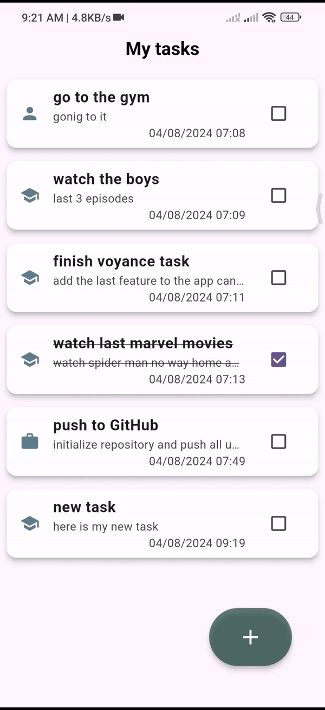

# To-Do App

## Overview

This is a simple To-Do app developed using Flutter and SQLite. The app allows users to manage their tasks effectively with features such as adding, updating, deleting tasks, and reordering tasks. It provides an intuitive interface for managing tasks with drag-and-drop functionality and swipe gestures.

## Features

- **Add Tasks**: Create new tasks through a dedicated screen for adding or editing tasks.
- **Update Tasks**: Edit existing tasks using the same screen used for adding tasks.
- **Delete Tasks**: Remove tasks either by swiping left or right on the task.
- **Reorder Tasks**: Rearrange tasks by dragging and dropping them to your preferred order.
- **Categorize Tasks**: Choose a category for every task which it's icon appears in the task card.  

## Screens

- **Task Display Screen**: Shows a list of all tasks with options to reorder and delete.

- **Add/Edit Task Screen**: Provides a form to add new tasks or edit existing ones.

## suggested feature 
- **Task Notifier**: Set reminders for tasks, which will notify the user of pending tasks or deadlines.

## Technologies Used

- **Flutter**: For building the mobile app interface and functionality.
- **SQLite**: For local database management and storing tasks.
